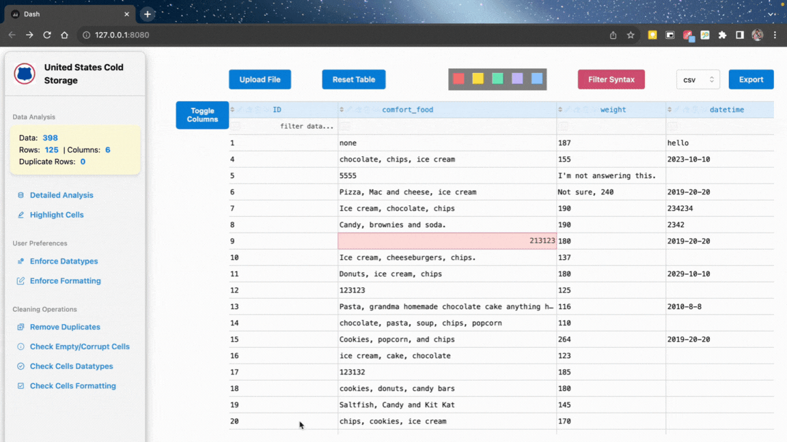
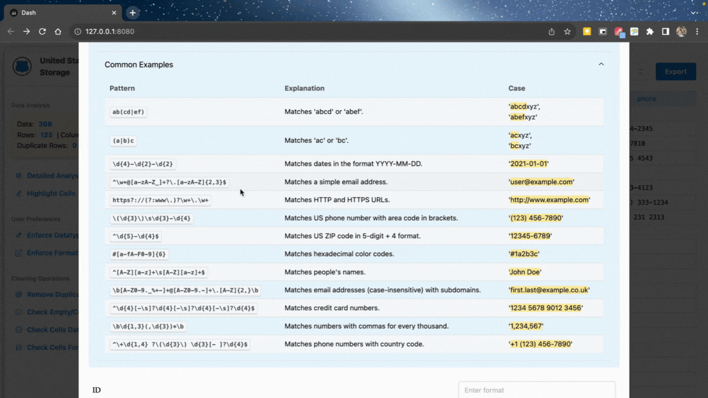

# Data Clean-up Tool



## Table of Contents

- [Data Clean-up Tool](#data-clean-up-tool)
  - [Table of Contents](#table-of-contents)
  - [Setup](#setup)
  - [Features](#features)
  - [Optimization](#optimization)
  - [Extras](#extras)
  - [Problem](#problem)
  - [Objectives](#objectives)


## Setup

To set up and run the Data Clean-up Tool, follow these steps:

1. Clone this repository to your local machine:

  ```bash
  git clone https://github.com/mustachemo/data-runners.git
  ```

2. Change to the project directory:

  ```bash
  cd data-cleanup-tool
  ```

3. Create a conda environment from the provided environment.yml file:

  ```bash
  conda env create -f environment.yml
  ```

  Optionally, to update conda environment using existing file:
  
  ```bash
  conda env update --file environment.yml --prune
  ```

4. Activate the newly created conda environment:

  ```bash
  conda activate data_cleanup_env
  ```

5. **Run the Application:**

   - Open a terminal and execute the following command:
   
     ```bash
     python run.py
     ```

   - **OR**

     - Open the command palette by pressing `Ctrl+Shift+P` (Windows/Linux) or `Cmd+Shift+P` (Mac).

     - Type "Run Task" and select "Tasks: Run Task" from the dropdown list.

     - Alternatively, you can use the keyboard shortcut `Ctrl+Shift+B` (Windows/Linux) or `Cmd+Shift+B` (Mac).

## Features

- Standard Features:

  - [x] Upload button to upload various forms of data 
    - [x] Style the button to make it look nice
  - [x] Display the data in a table
  - [x] All columns are displayed and are scrollable
  - [x] Up to 259 rows are displayed and are scrollable. Rest of data is cycled through pages system
  - [x] Export data into various forms
    - [x] We are able to export the data, but not the modified data. Must fix that
    - [x] Also need to make a button that exports the data into the format specified by the radio buttons
    - [x] Style export button!
  - [x] Make the columns/first row/headers sticky. Meaning they stay when scrolling


  - [x] Add enforcement of types. Say a column shows only numbers, let's say money. Enforce that you can't edit a text into there, only numeric values are allowed (https://dash.plotly.com/datatable/typing)
  - [x] Add a formatting setting that formats columns to a specified prefereance. For example, cost column will show $ sign and number type enforcement along with commas when needed (https://dash.plotly.com/datatable/typing)
  - [x] Adding or removing columns and rows
  - [ ] Update parse_content function to include 'xslx, xml, html" and "pdf" if we can (pdf is a bonus feature)
  - [x] Combine two or more data of the same format into one file
  - [z] After "Enforcing" dtypes or formatting, those cells are then highlighted (https://dash.plotly.com/datatable/conditional-formatting). We could also use for other use cases when highlighting is required. We should have a legend that says what each higlight color means
    - [x] dtype highlighting
    - [x] Highlighting None, NaN, or Empty String Values
    - [x] formatting highlighting
  - [z] Make legend for filtering operations/syntax (https://dash.plotly.com/datatable/filtering)
  - [ ] Testing (https://dash.plotly.com/testing)

- Bonus Features:

  - [ ] Make a tab option for graphs (https://dash.plotly.com/dash-core-components/tab)
  - [x] Highlight Changes: Display changed cells in a different color for easier tracking
  - [x] Add loading animation (https://dash.plotly.com/dash-core-components/loading)
  - [x] Make columns selection through a checkbox (https://dash.plotly.com/datatable/editable)
  - [ ] Displaying Errors with dash.no_update (https://dash.plotly.com/advanced-callbacks)
  - [ ] Taps for visuals and/or data analytics information (https://dash.plotly.com/dash-core-components/tabs) (https://dash.plotly.com/dash-core-components/graph)
  - [ ] Could style the table to make it nicer (bonus feature)

## Optimization

- [x] Get rid of df-store, no need to store in memory as we have the df stored as a variable in the instance of DataHandler
- [ ] Use callback_context to combine multiple callbacks to one [Determining which Input Has Fired with dash.callback_context] (https://dash.plotly.com/advanced-callbacks), also look at Duplicate Callback Outputs (https://dash.plotly.com/duplicate-callback-outputs), also look at this (https://dash.plotly.com/determining-which-callback-input-changed)
- [ ] Use Partial Property Update callback to highlight/unhighlight cells/rows/columns that match a specific pattern [Could be used for other cases] (https://dash.plotly.com/partial-properties) (Check clear section)
- [ ] Make callbacks more readable with Flexible Callback Signatures (https://dash.plotly.com/flexible-callback-signatures)
- [ ] Backend paging for loading a couple of rows per page (https://dash.plotly.com/datatable/callbacks)
- [ ] Performance (https://dash.plotly.com/performance)
- [ ] Remember user preferences? (https://dash.plotly.com/persistence)

## Extras

- [ ] Periodic Calling of callbacks/refreshing of page for real-time monitering (https://dash.plotly.com/dash-core-components/interval)
- [ ] Add more highlighting for differnet cases (https://dash.plotly.com/datatable/conditional-formatting)
- [ ] Format numbers [i.e. adding $ or % sign before or after numbers, commas between numbers, padding] (https://dash.plotly.com/datatable/data-formatting)
- [ ] Check out dash AG Grid (https://dash.plotly.com/dash-ag-grid/getting-started)
- [ ] Dev tools, Custom Timing Events
- [ ] Loading for text/small compone ts (https://dash.plotly.com/loading-states)
- [ ] Deployment (https://dash.plotly.com/deployment)
- [ ] help (https://community.plotly.com/c/python/25?utm_medium=dash_docs&utm_content=sidebar)

## Problem

The presence of large amounts of bad data which does not comply with the required format, currently not relevant and that has been entered into the warehouse management system (WMS) incorrectly and cannot be utilized for any purpose. This data always causes hinderance in many daily activities, become hurdles when the company transitions to a new WMS and most importantly occupies huge amounts of memory in the server systems. A tool which can help identify this bad data, modify it to required format and delete gaps, if necessary, can help resolve many of the forementioned issues.

## Objectives 

Objective is to design and function tool that can help the company to identify and delete, modify, fix this bad data, gaps in data, and eliminate a large amount as per user requirement. This will reduce manual work related to fixing this bad data.

- Standard Features:

  - [x] Ability to read various formats of data (xml, csv, pdf etc.;) and display in rows and columns.
  - [x] Give the user the ability to define each row or column of data according to the user’s preference. And modify or
display the data that is not according to the defined parameters. Preferably in GUI for a layman to use it.
  - [x] Combine different sets of data of same format into one set and customize as per user requirements.
  - [x] Ability to export into different formats as per user needs.

- Bonus Features:

  - [ ] Identify duplicate data in different formats, errors such as wrong address format, punctuation, spellings, and
address styles. Filter the data and display the rows and columns with these discrepancies.
  - [ ] Creating visuals from the data.

